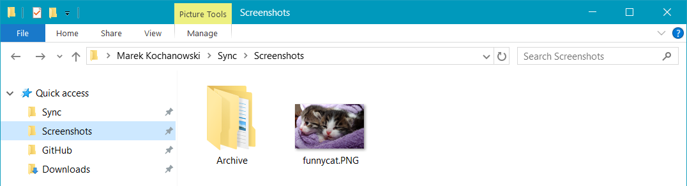
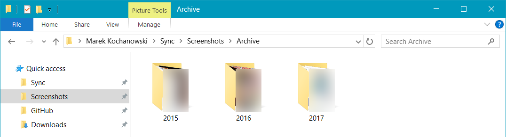
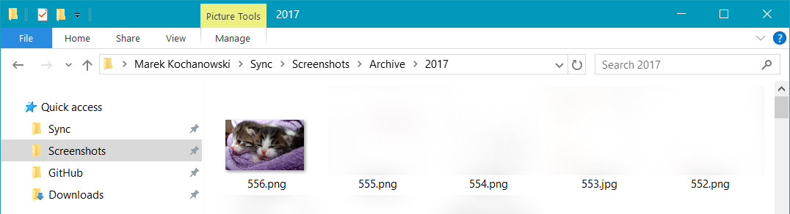
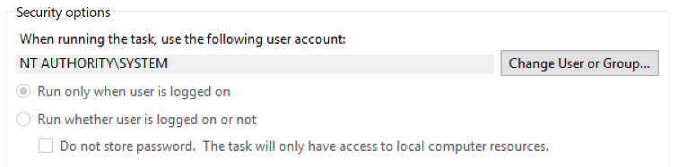
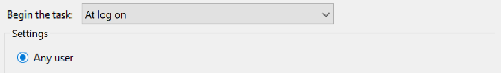
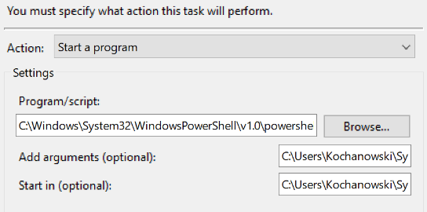

# Screenshot management
The simplest PowerShell script written for managing your screenshots folder.

# Use case
Do you capture and share screenshots regularly? If the answer to that question is positive, you probably have encountered some issues in the past.

You take one screenshot, use it two or three times and that's it. The screenshot is no longer needed.

And when you want to share it? The problem emerges when you have *thousands* of screenshots that cause your **File Explorer** to load every thumbnail really slowly which extends the waiting time.

This script in combination with Windows' *Task Scheduler* allows for creating sessions for screenshot sharing by archiving no longer needed files.

# How the script works
Instead of running in the background and actively monitoring the directory all the time, the `task.ps1` script is run only once when a new session needs to be initialized.

Once the `task.ps1` is run, it takes every image in `$workingDirectory`, saves the images' `LastWriteTime` and archives it under `$archiveDirectory` within a subfolder of a current year. The file is renamed to a numerical index and the file extension is standardized to avoid conflicts.

### Example


You only have one saved file named `funnycat.PNG` in your `$workingDirectory` and set the *Task Scheduler* to run the script every time you turn on the computer.
That means if you turn off and turn your computer back on, the Task Scheduler *Trigger* will launch the script, the `$workingDirectory` will be emptied and the `funnycat.PNG` file will be renamed and archived. 



Because you already have archived a total number of **555** screenshots in the year **2017**, the file will be renamed to `556.png` and moved to `$archiveDirectory/2017/556.png`. As you can see, the file was initially saved with a `.PNG` extension and was later changed to `.png`. 



Saving files with `.PNG` instead of `.png` is the default behavior of **Windows Snipping Tool** and the script helps with unifying your image files extensions.

# Configuration
The script has three configurable path variables:
`$mainDirectory`, `$workingDirectory` and `$archiveDirectory`.
By default, the `$workingDirectory` is the same as `$mainDirectory`, but you are free to change this setting.

### Example
```
$mainDirectory = "Screenshots"
$workingDirectory = $mainDirectory + "\ActiveSession"
$archiveDirectory = $mainDirectory + "\Archive"
```
When the script is launched by the *Task Scheduler*, it starts itself within a predefined active directory. Let's say it's configured to start in `C:\Users\username\Documents\`.

Directories for the script will be set to:
- `$mainDirectory` to `C:\Users\username\Documents\Screenshots\`
- `$workingDirectory` to `C:\Users\username\Documents\Screenshots\ActiveSession\`
- `$archiveDirectory` to `C:\Users\username\Documents\Screenshots\Archive\`

### Optional script configuration
`$year` - Year variable that sets the folder names in `$archiveDirectory`
1. The **default** one will check for every file's `LastWriteTime` and assign a correct creation year of the image. 
2. The **second** setting will assign every available screenshot to the current year thus moving everything to a single folder.

`$path` - Full path for archiving files. You can modify it to your liking, for example, by adding a current month folder. Or something completely different. The default value is:
```
$path = $archiveDirectory + "\" + $year + "\"
```

### Task Scheduler configuration
If you don't want to launch the script manually *(you don't)*, you have to set a **Task** in Windows *Task Scheduler*.
1. Open **Task Scheduler** and select **Task Scheduler Library** on the left pane. You can create a new folder if you want to keep track of your tasks. Name it however you like.
2. Select the folder and click **Create Task...**
3. In the **General** Tab give your task a name like "Screenshots management"
4. In **Security Options** click **Change User or Group** and set it to `SYSTEM`. This will prevent the PowerShell console window from showing when the script is running.
  
5. Go to **Triggers** and add a new one. You can configure the trigger to launch every time you log in.
  
   

6. Go to **Actions** and select **Start a program**. Configure it as follows:
  
   **Program/script**: Path to the PowerShell executable. The default path is `C:\Windows\System32\WindowsPowerShell\v1.0\powershell.exe`
  
   **Add arguments**: Full path to the `task.ps1` script, e.g. `C:\Users\username\Scripts\task.ps1`
  
   **Start in**: Directory that the script will be launched in (see: [configuration](#example-1)) e.g. `C:\Users\username\Screenshots\`
 
   
7. If needed, make necessary changes in **Conditions** and **Settings** tabs.
8. Save the Task and run if for the first time! The script should archive every available screenshot in your `$workingDirectory`.
